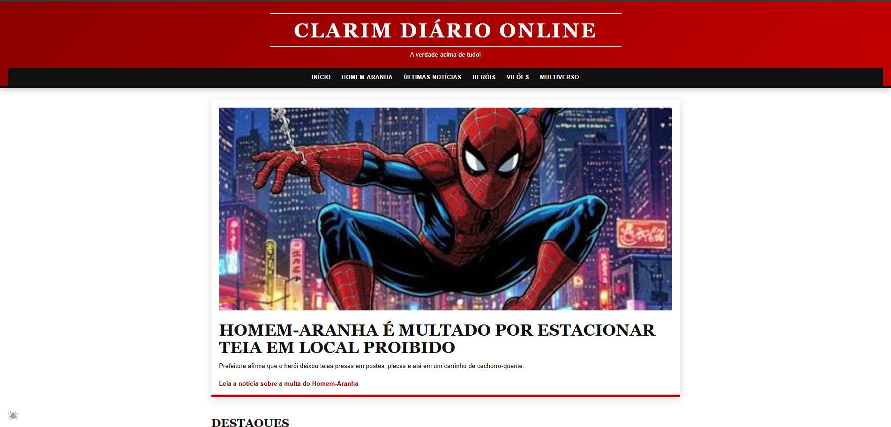

# 📰 Clarim Diário

Portal de notícias fictício inspirado no universo dos super-heróis.

O projeto foi desenvolvido com HTML, CSS e JavaScript puro, com foco em responsividade, acessibilidade, organização semântica e interatividade.

## 🚀 Acesse o projeto

https://paulo967.github.io/multiverso-news/

## ✨ Funcionalidades

- Página inicial com notícias em destaque
- 10 notícias individuais
- Carrossel automático
- Menu responsivo
- Navegação por categorias
- Easter Eggs interativos
- Animação de perseguição
- Mensagem secreta
- Plantão humorístico
- SEO básico
- HTML semântico
- Recursos de acessibilidade

## 🛠️ Tecnologias utilizadas

- HTML5
- CSS3
- JavaScript
- Git
- GitHub
- GitHub Pages
- Python

## 🕷️ Easter Eggs

1-Existe uma pequena aranha escondida no site.
Ao clicar nela, uma perseguição especial acontece na tela.
2- Ao clicar 5 vezes na logo exibe uma mensagem
3- Nos primeiros 10 segundos navegados exibe uma outra mensagem 

## 🎯 Objetivo do projeto

O objetivo foi praticar:

- HTML semântico
- CSS responsivo
- JavaScript e DOM
- eventos e animações
- Git e GitHub
- publicação com GitHub Pages

## 📚 Aprendizados

Durante o desenvolvimento deste projeto, pratiquei:

- Estruturação semântica com HTML
- Responsividade com CSS
- Flexbox e Grid
- Manipulação do DOM com JavaScript
- Eventos e interações
- Animações com CSS
- Organização de arquivos e páginas
- Controle de versão com Git
- GitHub e GitHub Pages
- Noções de SEO e acessibilidade

## 👨‍💻 Autor

Desenvolvido por Paulo Petrit.